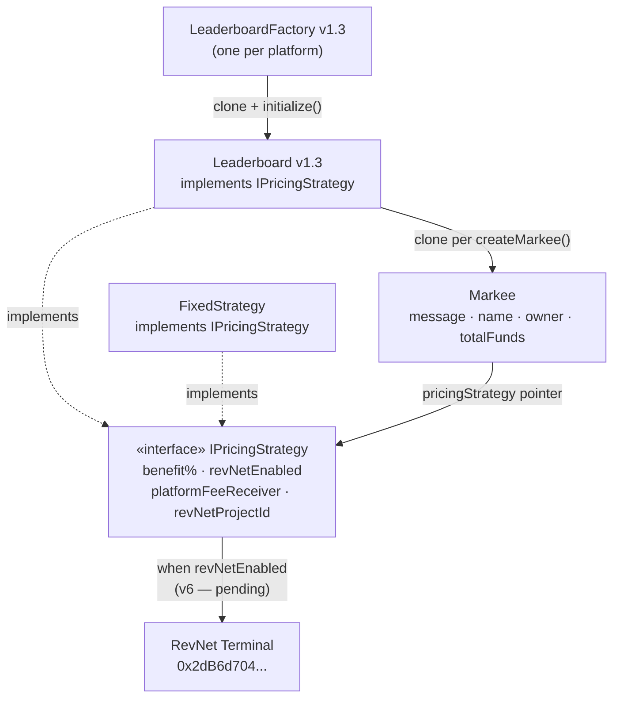
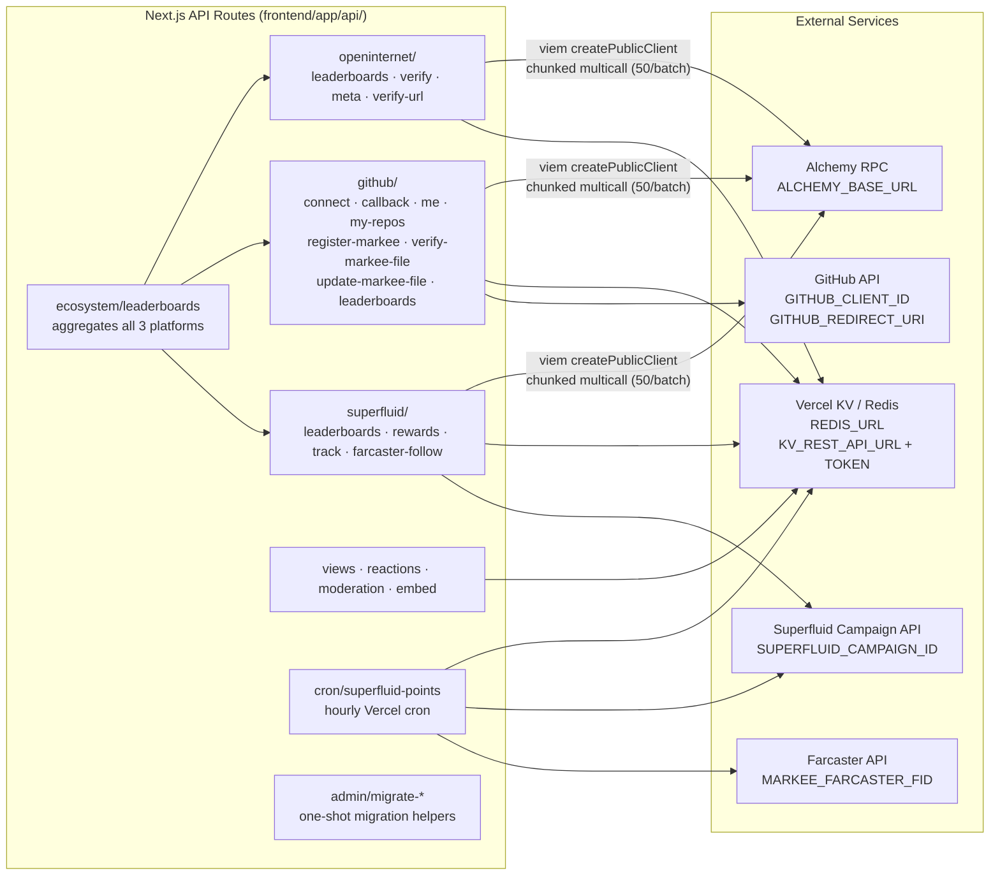

# Markee Protocol — Architecture

> Developer reference: contracts → API layer → integrations → data storage.

---

## Smart Contracts

Two-clone architecture. **LeaderboardFactory** deploys **Leaderboard** clones; each Leaderboard deploys **Markee** clones. All pricing strategies implement **IPricingStrategy**.



**Key behaviours:**
- Every Markee's `pricingStrategy` points to its parent Leaderboard. `setMessage/addFunds` can only be called by `pricingStrategy`.
- A Markee can migrate off a Leaderboard to a different strategy (e.g. FixedStrategy) via `migratePricingStrategy()`.
- **FixedStrategy** is used only by the 3 static markees on the home page ("this is a sign.", etc.).
- RevNet (`project 119` on Base, terminal `0x2dB6d704058E552DeFE415753465df8dF0361846`) receives a platform fee when `revNetEnabled = true` — currently `false`, waiting for RevNet v6. Currently 100% of payment goes to beneficiary.
- Canonical implementation: `contracts/v1.0/` (v1.1 adds `platformFeeReceiver`).

---

## LeaderboardFactory Implementations

Three factory instances on Base, same underlying contract, different platform context.

| Factory | Address (Base) | Use Case |
|---------|---------------|----------|
| OpenInternet | `0xFD488A0fE8D4Fa99B4A6016EA9C49a860A553F7c` | Any website owner embeds Markee on their site |
| GitHub | `0xdF2A716452a3960619cDdDCDe4E10eACcFFDa0A2` | Repo maintainers add Markee to markdown files |
| Superfluid | `0xC497187AAa35C26b0008B43C10A6F6300b7eBcad` | Superfluid manages one leaderboard for their campaign ecosystem |

**Partner Platform Pattern:** A platform (like Superfluid) deploys one Leaderboard via their factory, adds many Markees on behalf of users, controls the beneficiary, and surfaces the leaderboard in their own UI. Each new platform integration needs its own factory and its own verification standard (see §Integration & Verification).

---

## API Layer



**Environment Variables:**

| Variable | Used By |
|----------|---------|
| `ALCHEMY_BASE_URL` | All API routes doing on-chain reads (defaults to Base public RPC) |
| `GITHUB_CLIENT_ID` / `GITHUB_REDIRECT_URI` | GitHub OAuth flow |
| `SUPERFLUID_CAMPAIGN_ID` / `TEST_SUPERFLUID_CAMPAIGN_ID` | Superfluid points cron |
| `MARKEE_FARCASTER_FID` | Superfluid points cron — Farcaster follower lookup |
| `NEXT_PUBLIC_SITE_URL` | Embed widget absolute URLs |
| `REDIS_URL` | Vercel KV (standard client) |
| `KV_REST_API_URL` / `KV_REST_API_TOKEN` | Upstash REST API with strong consistency (GitHub linked files) |
| `ADMIN_SECRET` | Admin migration endpoints |

---

## Views · Reactions · Moderation

All stored in Vercel KV. Client hooks (`useViews`, `useReactions`) call the API routes.

| Feature | KV Key | Notes |
|---------|--------|-------|
| View count | `views:total:{markeeAddress}` | Deduped: `dedup:{ip}:{address}` (1h TTL) |
| Per-message views | `views:msg:{address}:{msgHash}` | MD5 of first 8 chars of message |
| Emoji reactions | `reactions:v2:{markeeAddress}` (HSET) | Requires ≥100 MARKEE tokens; 1 change/user/30s |
| Balance cache | `balance:markee:{address}:{chainId}` | 5 min TTL — ERC20 `balanceOf` via viem |
| Moderation flags | `moderation:flagged` (Redis SET) | Admin wallet signature required |

MARKEE ERC20 (all chains): `0xee3027f1e021b09D629922D40436C5DeA3c6cb38`

---

## Integration & Verification

Each factory type has its own verification model. **Any new factory must define its own.**

### GitHub
1. User creates Leaderboard on-chain via GitHub factory.
2. User adds address-specific delimiters to a markdown file in their repo:
   ```html
   <!-- MARKEE:START:0x{leaderboardAddress.toLowerCase()} -->
   <!-- MARKEE:END:0x{leaderboardAddress.toLowerCase()} -->
   ```
3. `/api/github/verify-markee-file` fetches raw file, checks for delimiters → stores `github:markee:{address}` in KV.
4. On success (and on every top-message change), `/api/github/update-markee-file` renders an ASCII billboard and PUTs updated file content via GitHub API using the linked user's stored OAuth token.
5. Legacy address fallback: `getLinkedFiles()` in `lib/github/linkedFiles.ts` falls back to v1.1/v1.0 addresses before looking up KV — handles users who haven't updated their delimiter text post-migration.

### OpenInternet (Website)
1. User creates Leaderboard via UI modal (on-chain tx), adds embed code to their site.
2. Admin manually calls `POST /api/openinternet/verify` — requires wallet signature from `0xAf4401...` (Markee Cooperative multisig).
3. Sets `oi:meta:{address}` → `{ status: "verified", verifiedUrl, logoUrl, siteUrl }`.
4. Verified leaderboards appear in "Top Verified Markees" on ecosystem page.

### Superfluid (Partner Platform)
- Platform relationship is the verification — no URL check or file delimiter needed.
- Platform manages their own Leaderboard and surfaces it within their UI.

---

## RevNet / MARKEE Token

```
Payment (when revNetEnabled = true — pending RevNet v6 deployment):

  User pays ETH → Leaderboard.addFunds()
    ├── 62% → beneficiary wallet  (percentToBeneficiary = 6200)
    └── 38% → RevNet Terminal 0x2dB6d704...
                └── project 119 (Base) → mints MARKEE tokens → distributed to holders/reserves

Currently: revNetEnabled = false, 100% → beneficiary.
```

Cross-chain RevNet project IDs: Base `119`, Optimism `63`, Arbitrum `62`, Mainnet `56`.

---

## Key Dev Notes

- **Base only** — all Markee contracts are on Base mainnet. RevNet accepts cross-chain ETH payments but Markee itself does not.
- **Clone pattern** — EIP-1167 minimal proxies for both Leaderboard and Markee. Read `contracts/v1.0/` for canonical implementations (v1.1 diff: adds `platformFeeReceiver`).
- **KV strong consistency** — GitHub-linked file reads use Upstash REST API directly with `Upstash-Consistency: strong` to avoid replica lag on page refresh.
- **Cache busting** — all leaderboard APIs support `?bust=1` to skip the 60s KV cache. Always pass it after leaderboard creation and on the `/account` page.
- **Creator ≠ admin** — Leaderboard `admin` is the beneficiary address, not the deployer. Creator is derived from factory event logs + `eth_getTransaction.from`, cached permanently as `creator:oi:{address}` / `creator:sf:{address}`.
- **Polling** — wagmi set to `pollingInterval: 120_000` to avoid Alchemy rate limits.
- **No test suite** — verify changes by deploying to Vercel and checking logs.
- **Superfluid points cron** — runs hourly via Vercel, processes `FundsAdded` events from factory (RPC) and Farcaster follower data. Tracks last processed block in `superfluid:cron:rpcLastBlock`.
